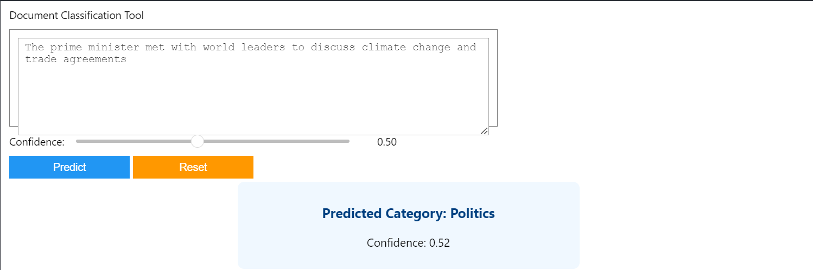
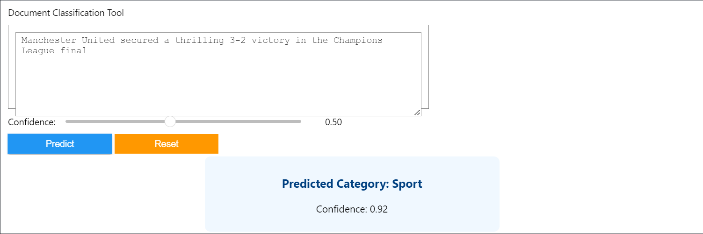
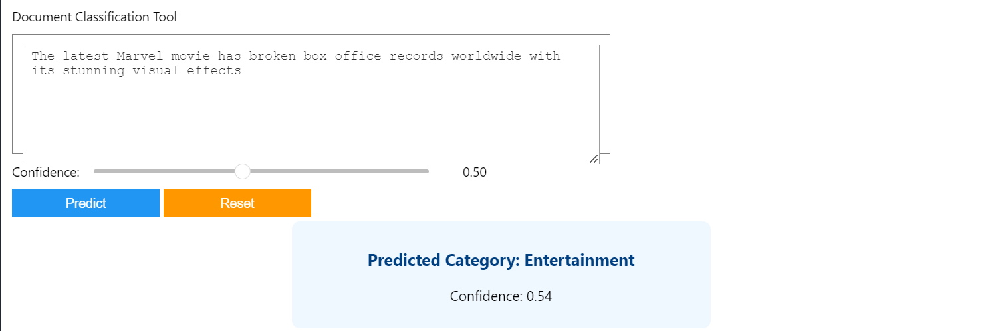
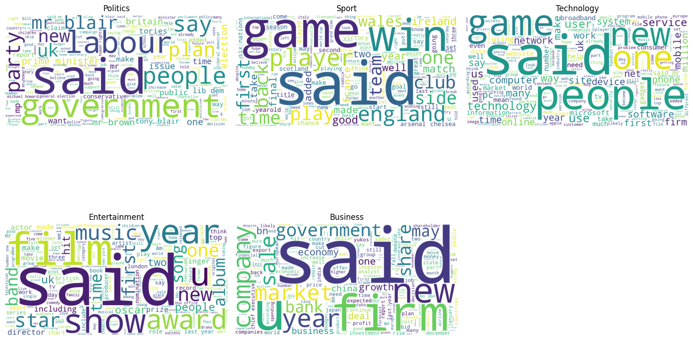
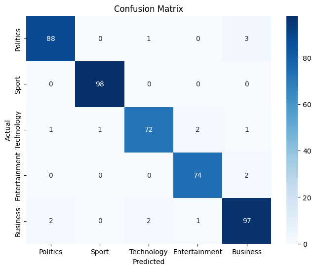

---

# 📄 Document Classification System

Welcome to the **Document Classification System**! This project is a Python-based implementation of a supervised learning system that classifies text documents into categories such as **Politics**, **Sport**, **Technology**, **Entertainment**, and **Business**. It also includes an **`Other`** category for texts that don’t match any predefined category.

---

## 🌟 Features

- **Text Preprocessing**: Cleans and preprocesses text data (lowercase, punctuation removal, stopwords removal).
- **TF-IDF Vectorization**: Converts text into numerical features for machine learning.
- **Naive Bayes Classifier**: Trains a model to classify documents into categories.
- **Interactive UI**: Allows users to input text and predict its category.
- **Visualizations**:
  - Confusion Matrix: Displays model performance.
  - Word Clouds: Visualizes the most frequent words in each category.
- **Model Persistence**: Saves the trained model and vectorizer for future use.

---

## 🚀 Quick Start

### Prerequisites
- Python 3.8+
- Jupyter Notebook (for interactive usage)
- Required Python libraries: `pandas`, `numpy`, `scikit-learn`, `nltk`, `matplotlib`, `seaborn`, `wordcloud`, `ipywidgets`

### Installation
1. Clone the repository:
   ```bash
   git clone https://github.com/Birkity/document-classification.git
   cd document-classification
   ```
2. Install the required libraries:
   ```bash
   pip install -r requirements.txt
   ```
3. Open the Jupyter Notebook:
   ```bash
   jupyter notebook document_classification.ipynb
   ```

---

## 🖥️ Usage

1. **Load Your Dataset**:
   - Place your dataset in the `data` folder and update the path in the notebook.
   - Ensure the dataset has columns named `Text` and `Label`.

2. **Run the Notebook**:
   - Execute each cell in the notebook to preprocess the data, train the model, and set up the interactive UI.

3. **Interactive Search**:
   - Enter your text in the input box and click "Predict".
   - The system will display the predicted category, including `Other` for unmatched texts.

---

## 📊 Visualizations
### Sample Outputs







### Word Clouds


### Confusion Matrix


---

## 🛠️ Code Structure

```
document-classification/
├── models/                   # Saved models and vectorizers (ignored by .gitignore)
│   ├── document_classifier.pkl
│   └── tfidf_vectorizer.pkl
├── data/                     # Dataset folder (ignored by .gitignore)
│   └── df_file.csv
├── images/                   # Folder for storing visualizations
│   ├── confusion_matrix.png
│   └── wordclouds.png
├── document_classification.ipynb  # Main Jupyter Notebook
├── requirements.txt          # List of dependencies
├── README.md                 # Project documentation
└── .gitignore                # Specifies files/folders to ignore
```

---

## 🤝 Contributing

Contributions are welcome! If you'd like to contribute, please follow these steps:
1. Fork the repository.
2. Create a new branch (`git checkout -b feature/YourFeatureName`).
3. Commit your changes (`git commit -m 'Add some feature'`).
4. Push to the branch (`git push origin feature/YourFeatureName`).
5. Open a pull request.

---

## 📄 License

This project is licensed under the MIT License. See the [LICENSE](LICENSE) file for details.

---

## 🙏 Acknowledgments

- Thanks to the creators of `scikit-learn`, `nltk`, and `matplotlib` for their amazing libraries.
- Inspired by the need for efficient document classification systems in natural language processing (NLP).

---

## 📧 Contact

For questions or feedback, feel free to reach out:

- **Birkity**  
- **Email**: birkity.yishak.m@gmail.com  
- **GitHub**: [Birkity](https://github.com/Birkity)  

---

Made with ❤️ by **Birkity**  
✨ Happy Coding! ✨

---